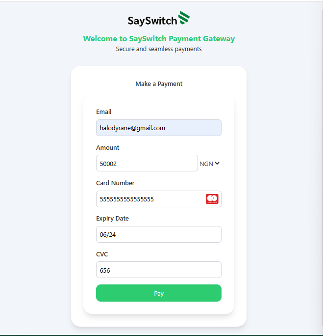

# SaySwitch Payment Gateway Frontend

A sophisticated and responsive frontend for the SaySwitch payment gateway, designed to simulate the functionality of well-known payment systems like Stripe and Paystack.

## Table of Contents

- [Demo](#demo)
- [Features](#features)
- [Tech Stack](#tech-stack)
- [Installation](#installation)
- [Usage](#usage)
- [Folder Structure](#folder-structure)
- [API Documentation](#api-documentation)
- [Contributing](#contributing)
- [License](#license)

## Demo



## Features

- Responsive design
- Modular and maintainable codebase
- Secure payment form
- Real-time validation
- Customizable with Tailwind CSS

## Tech Stack

- Vite
- React
- Tailwind CSS
- Axios

## Installation

### Clone the repository

```sh
git clone https://github.com/Dr-dyrane/paymentLandingpage.git
cd sayswitch-payment-frontend
```

### Install dependencies

```sh
npm install
```

or with `yarn`

```sh
yarn install
```

## Usage

### Start the development server

```sh
npm run dev
```

or with `yarn`

```sh
yarn dev
```

Open your browser and navigate to `http://localhost:3000` to see the application in action.

## Folder Structure

```
src/
├── assets/
│   ├── demo.png
│   └── logo.svg
├── components/
│   ├── FormInput.jsx
│   ├── PaymentForm.jsx
│   └── PaymentHandler.jsx
├── pages/
│   └── LandingPage.jsx
├── utils/
│   ├── constants.js
│   └── validation.js
├── App.jsx
├── index.css
└── main.jsx
tailwind.config.js
```

### Description of Key Files

- **components/FormInput.jsx**: A reusable input component for the payment form.
- **components/PaymentForm.jsx**: The main form component that collects payment details.
- **components/PaymentHandler.jsx**: Handles the payment logic, making API calls and managing the form state.
- **pages/LandingPage.jsx**: The landing page that integrates all components and presents the UI.
- **utils/constants.js**: Contains constants like `BASE_URL` and `SAYS_SWITCH_PUBLIC_KEY`.
- **utils/validation.js**: Provides validation logic for the form inputs.

## API Documentation

For API testing and documentation, you can use Postman. Below are the steps to set up and test the API with Postman.

### Setting Up Postman

1. **Download and Install Postman**: If you haven't already, download and install Postman from the [official website](https://www.postman.com/downloads/).

2. **Import the Collection**:
    - Download the Postman collection file: [SaySwitch Payment API Collection](./postman/SaySwitch_Payment_API_Collection.json).
    - Open Postman and click on the "Import" button.
    - Select the downloaded collection file to import it into Postman.

3. **Configure Environment Variables**:
    - In Postman, go to the "Environments" tab and create a new environment.
    - Add the following variables to the environment:
        - `BASE_URL`: The base URL for the API (e.g., `http://localhost:3000`).
        - `SAYS_SWITCH_PUBLIC_KEY`: Your public key for the payment gateway.

### Making API Requests

Once the collection and environment are set up, you can start making API requests:

1. **Select Environment**: Ensure that your created environment is selected in the environment dropdown.
2. **Run Requests**: Navigate through the imported collection and run the available requests to test the payment API.

## Contributing

1. Fork the repository.
2. Create a new feature branch: `git checkout -b feature-name`.
3. Commit your changes: `git commit -am 'Add new feature'`.
4. Push to the branch: `git push origin feature-name`.
5. Open a pull request.

## License

This project is licensed under the MIT License. See the [LICENSE](LICENSE) file for more details.

---

Created with ❤️ by [Dr Dyrane](https://github.com/Dr-dyrane).
